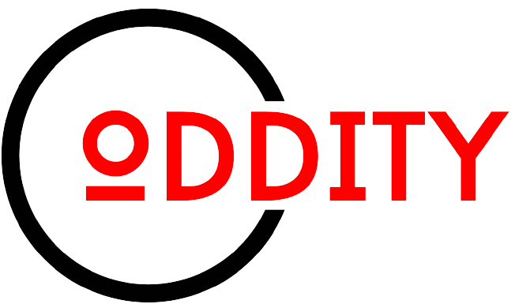

# ODDITY Sports Betting Website



Welcome to Oddity, your premier destination for sports betting. Whether you're an avid sports fan or looking for some excitement, Oddity has you covered. Place your bets and enjoy the thrill of the game!

## Table of Contents

- [Features](#features)
- [Getting Started](#getting-started)
  - [Prerequisites](#prerequisites)
  - [Installation](#installation)
- [Usage](#usage)
- [Contributing](#contributing)
- [License](#license)

## Features

- **Sports Betting:** Place bets on a wide range of sports and events.
- **Live Updates:** Stay updated with real-time scores, statistics, and odds.
- **User Accounts:** Create and manage your user profile.
- **Secure Transactions:** Secure payment processing for deposits and withdrawals.
- **Responsive Design:** Access Oddity on various devices, from desktop to mobile.

## Getting Started

### Prerequisites

Before you start using Oddity, make sure you have the following prerequisites:

- **Node.js:** Ensure that you have Node.js installed on your system. You can download it [here](https://nodejs.org/).

### Installation

1. **Clone the repository:**

   ```bash
   git clone https://github.com/oddity-betting/oddity.git
   ```
   
2. **Navigate to the project directory:**

   ```bash
   cd oddity
   ```
3. **Install the required dependencies:**

   ```bash
   npm install
   ```
4. Set up your environment variables by creating a `.env` file based on the provided [.env.example](.env.example). Update the values accordingly.
## Usage

5. **Start the application:**

   ```bash
   npm run dev
   ```

- Access Oddity in your web browser at `http://localhost:3000`.

- Create a user account or log in to get started.

- Browse the available sports and events, place bets, and enjoy the excitement of sports betting.

## Contributing

We welcome contributions from the community. If you'd like to contribute to Oddity, please follow our [Contribution Guidelines](CONTRIBUTING.md).


